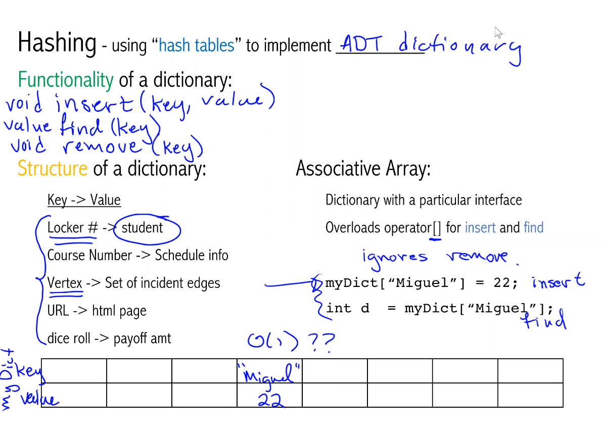
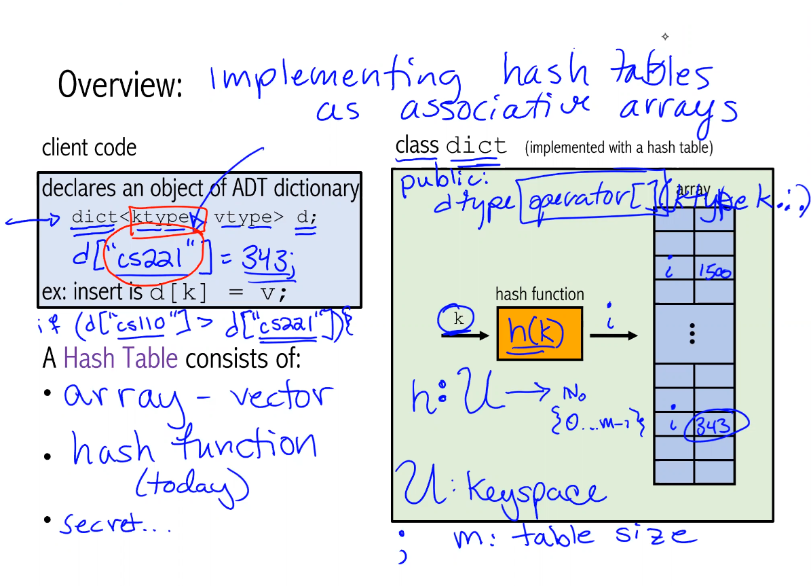
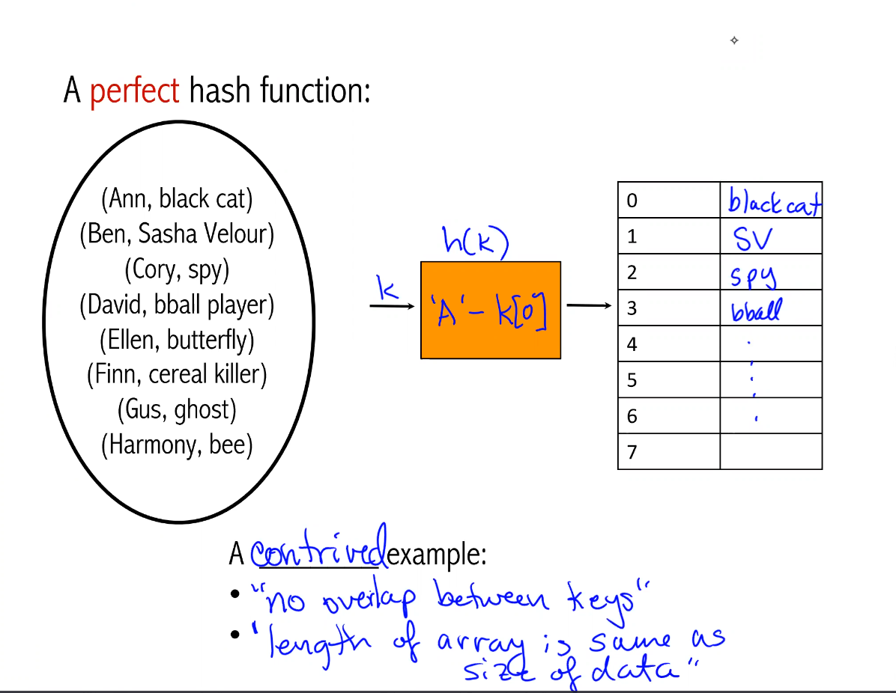
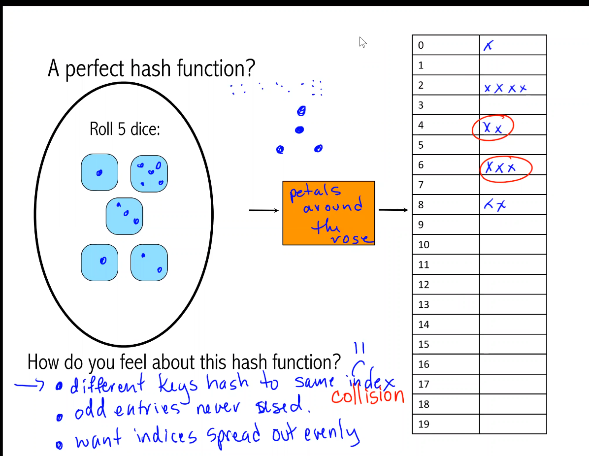
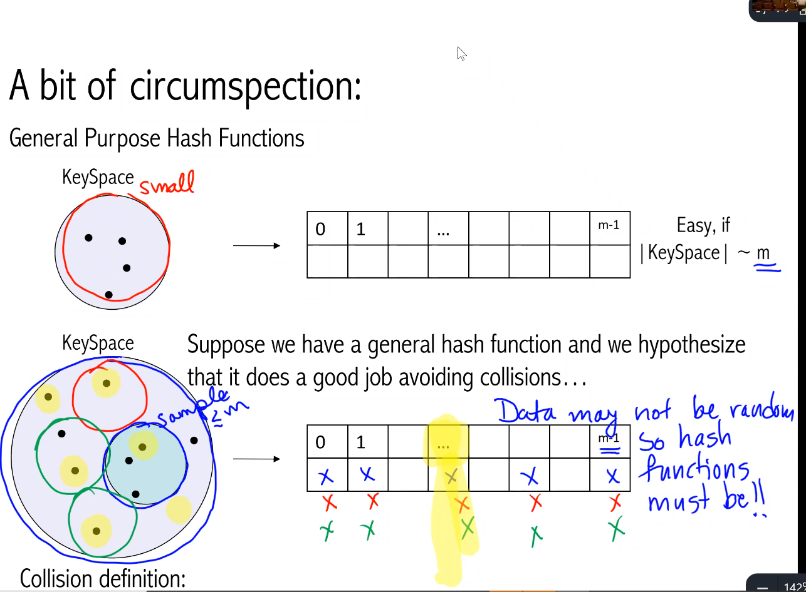

# Week 10 Introduction to Hashing

Hashing - using "hash tables" to implement ADT dictionary 

Functionality of a dictionary:
``` c++ 
void insert(key, value);
int find(key);
void remove(key);
```
  
  
  
  
  