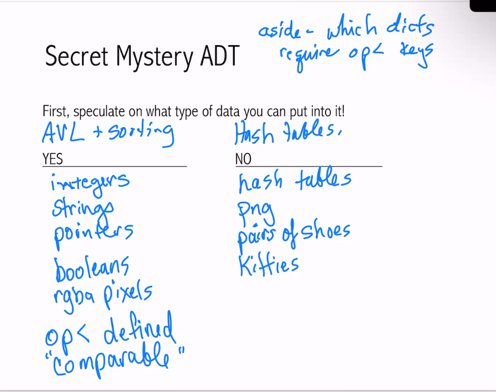
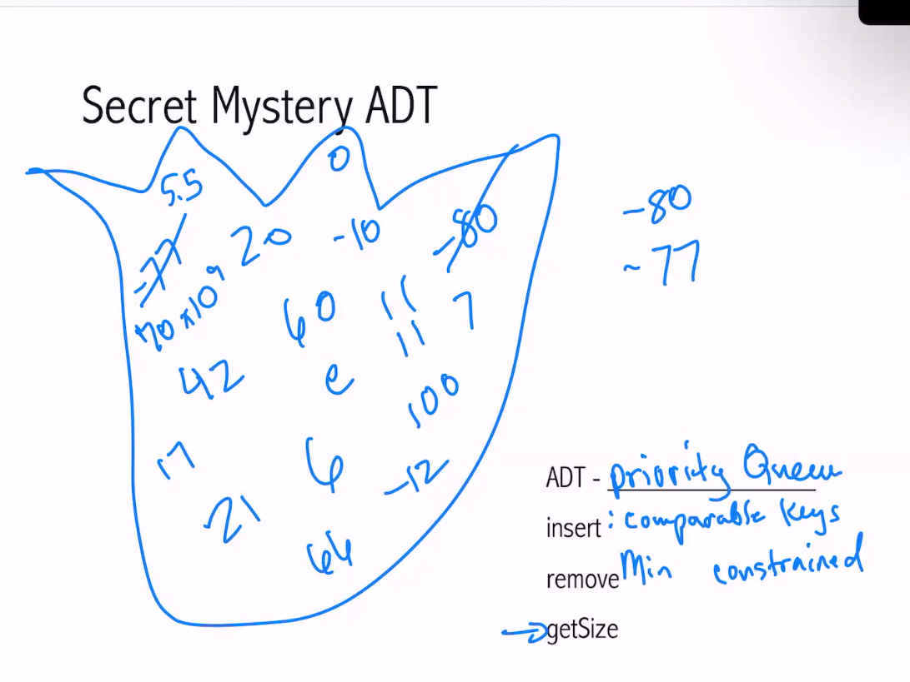
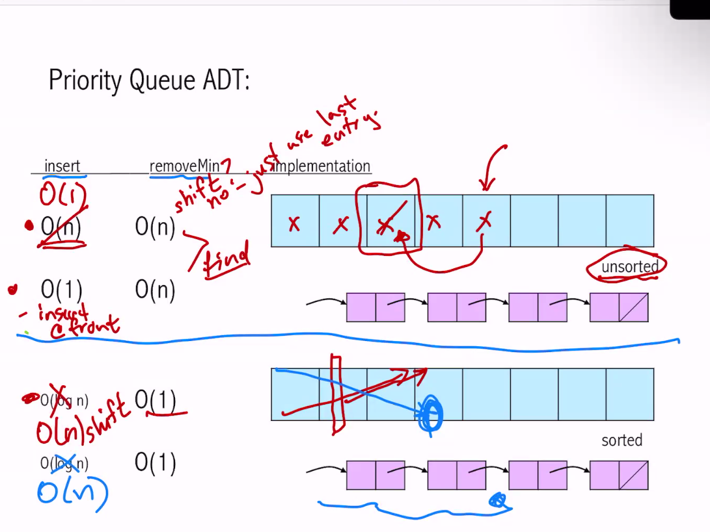
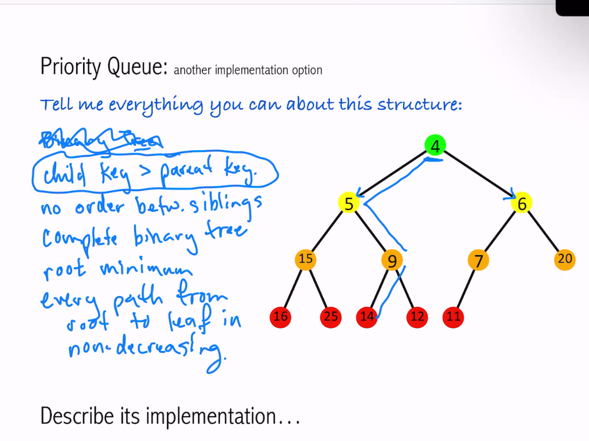
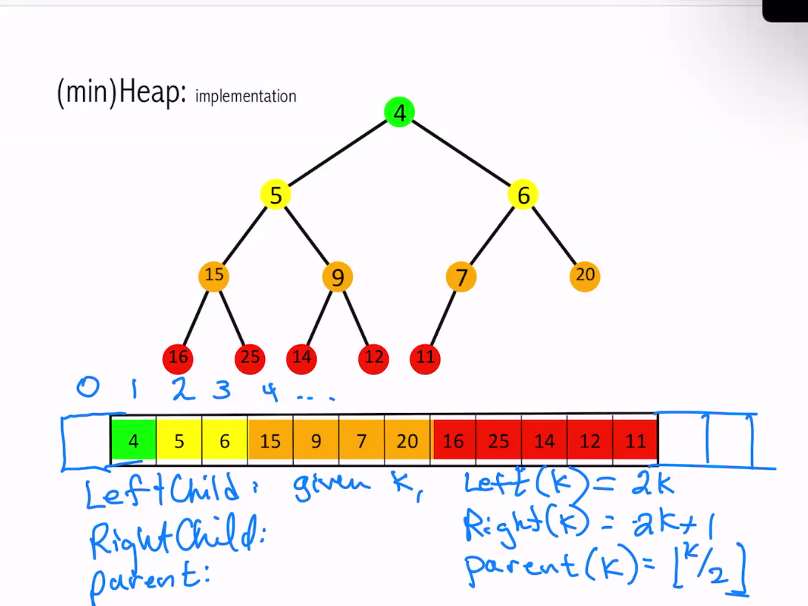
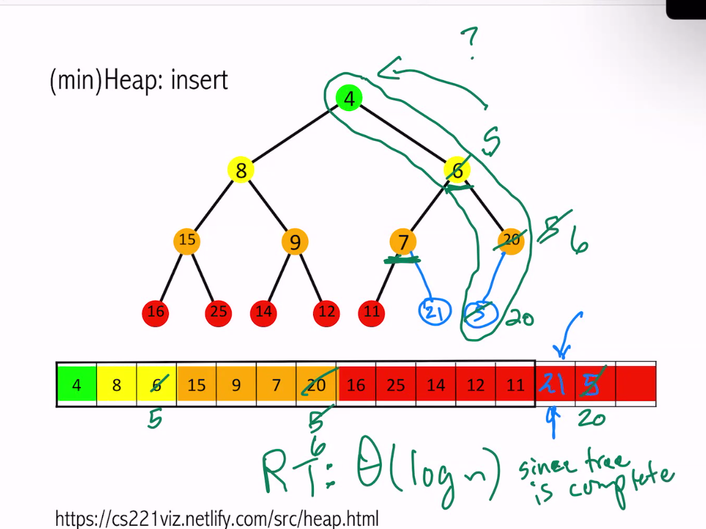

# Priority Queues
## Review hash tables
Running time of hash table depend on $\alpha$.
Constant time is achieved by keeping $\alpha$ constant.

Thus, running time of hash table is $O(1)$. (relies on resizing / amortised)

  
  
  
  
  
  
